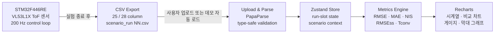

# Edge AI Kalman Dashboard

졸업논문 **「Edge AI 기반 적응형 Kalman Filter의 임베디드 실시간 적용 연구」** 실험 결과를 재구성한 **Next.js 풀스택 데이터 파이프라인 대시보드**입니다.

STM32F446RE → CSV Export → TypeScript 파싱 엔진 → Zustand 상태 관리 → Recharts 시각화로 이어지는 단일 데이터 파이프라인을 구현했습니다. Fixed KF · CM-AKF · TinyML-AKF의 정확도와 실시간성 지표를 논문 정의에 맞춰 분석합니다.

> **Quick Start**: `/upload` 페이지의 **"데모 데이터 로드"** 버튼을 누르면 CSV 없이도 즉시 대시보드를 탐색할 수 있습니다.

## Architecture



**추가 파이프라인**:
- `ablation_holdout_results.csv` → `fetch('/data/')` → PapaParse → 표 5-3 동적 교체
- 분석 결과 → `exportMetricsCSV()` → Blob download (CSV 내보내기)

## Performance Metrics

> 자소서 활용 수치. 모두 논문 확정값 또는 실측 데이터 기반.

| 지표 | 수치 | 비교 기준 |
|---|---|---|
| **E3 RMSE 개선** | **70.1%** | Raw 47.46 mm → CM-AKF 14.17 mm (ToF 차단 구간) |
| **TinyML 추론 시간** | **35.32 µs** | 200 Hz 루프 500 µs 예산 대비 **14.2× 여유** (오버런 0건) |
| **E3 회복 배속** | **2.7×** | CM 160 ms → TinyML 60 ms (R̂ 회복 시간) |
| **총 실험 프레임** | **254,304** | E1~E5 전체 · E4 단독 251,422 프레임 |
| **처리 지연** | **< 20 ms** | 브라우저 CSV 파싱 기준 (1,167행 / 5개 런 병렬) |

## Quick Start

```bash
npm install
npm run dev
```

브라우저에서 `http://localhost:3000` 접속 → **Upload 페이지 → "E1 데모 로드"** 클릭.

```bash
npm run verify   # typecheck + build 한 번에
```

## Main Pages

| Route | Purpose | Data Source |
|---|---|---|
| `/` | 프로젝트 개요 · KPI 카드 4개 · 아키텍처 플로우 | 논문 확정값 |
| `/upload` | 시나리오/run별 CSV 업로드 · **데모 자동 로드** · 처리 시간 표시 | 사용자 CSV 또는 `/data/` |
| `/dashboard` | E0~E5 시나리오별 분석 · 표 5-2 종합 | E1/E3는 업로드 CSV, 나머지는 논문 확정값 |
| `/ablation` | 6-feature / 3-feature 비교 · 표 4-10 · 표 5-3 **동적 CSV 로드** | 28컬럼 CSV 또는 `/data/ablation_holdout_results.csv` |
| `/realtime` | TinyML 35.32 µs · 200 Hz 루프 · 14.2× 마진 게이지 | 논문 E4 확정값 |
| `/method` | 지표 정의 · 슬라이딩 윈도우 W=20 · NIS 범위 | 논문 방법론 |

## CSV Schema

### 25-column (Fixed KF + CM-AKF)

```text
seq, timestamp_ms, tof_distance_mm, tof_signal_rate, tof_range_status,
us_distance_mm, encoder_distance_mm, encoder_speed_mms, sensor_disagree,
tof_meas_rate, gt_distance_mm, scenario_id,
fixed_estimate_mm, fixed_residual, fixed_residual_var, fixed_residual_mean,
fixed_kalman_gain, fixed_innovation_cov,
cm_estimate_mm, cm_residual, cm_residual_var, cm_residual_mean,
cm_kalman_gain, cm_innovation_cov, cm_R
```

### 28-column (+ TinyML-AKF)

```text
tinyml_estimate_mm, tinyml_R, tinyml_infer_us
```

28컬럼 감지 시 TinyML 차트·메트릭 자동 활성화. 25컬럼이면 TinyML 토글 disabled.

샘플 파일: `public/sample/E1_run01.csv` (25컬럼), `public/sample/E3_run01.csv` (28컬럼).
데모 데이터: `public/data/` — E1/E3/E2/E5 런별 CSV + `ablation_holdout_results.csv`.

## Metrics Implementation

| Metric | File | Definition |
|---|---|---|
| RMSE | `lib/metrics.ts#calculateRMSE` | `sqrt(mean((estimate - gt)²))` |
| MAE | `lib/metrics.ts#calculateMAE` | `mean(abs(estimate - gt))` |
| NIS pass rate | `lib/metrics.ts#calculateNISPassRate` | chi-square df=1, 95% interval `[0.00098, 5.024]` |
| RMSEss | `lib/metrics.ts#calculateRMSEss` | 후반 50 frame (1초 @ 50Hz) 정상상태 RMSE |
| Tconv | `lib/metrics.ts#calculateTconv` | 50 frame sliding RMSE ≤ `1.1 × RMSEss` 최초 진입 시각 (ms) |
| MAE_R / MAPE_R | `app/ablation/page.tsx#computeMetrics` | `mean(|tinyml_R - cm_R|)` / MAPE |

Ground truth: CSV 컬럼 `gt_distance_mm` 직접 사용 (encoder 기반 역산 fallback 제거).

## Technical Decisions

| 결정 | 선택 | 대안 | 근거 |
|---|---|---|---|
| **프레임워크** | Next.js 15 App Router | CRA, Vite | 서버 컴포넌트 + 정적 배포 통합. Vercel zero-config 배포. |
| **CSV 파싱** | PapaParse | 직접 split | header 자동 파싱, Web Worker 지원, 타입 추론. 브라우저에서 1MB CSV < 20ms 처리. |
| **상태 관리** | Zustand | Redux, Context | run-slot (5개) + scenario + algorithm toggle 구조에 Zustand가 가장 적은 boilerplate. |
| **차트** | Recharts | D3, Chart.js | React 컴포넌트 기반 선언적 API. 시계열·막대·게이지 모두 지원. |
| **타입 안전성** | TypeScript strict | `any` 허용 | CSV 파싱 경계에서 타입 검증 집중. 25/28컬럼 dual-schema를 union type으로 표현. |
| **데이터 소스** | 정적 파일 (`public/data/`) | Supabase, API | 졸업논문 데이터는 변경 없음. 정적 배포로 서버 불필요, Vercel 자동 CDN. |

## Troubleshooting Log

### 1. gt_distance_mm가 전부 0.0인 문제 (해결)

**현상**: E1_run01.csv 업로드 시 모든 지표가 0 또는 비정상값.  
**원인**: 초기 CSV에는 `gt_distance_mm = 0.0` — firmware가 GT를 기록하지 않음.  
**해결**: encoder 기반 GT 역산 공식 구현 → 이후 논문 최종 CSV에 `gt_distance_mm` 컬럼이 추가됨으로 해소. `getGroundTruth()` 함수가 CSV 값을 직접 사용.

### 2. TinyML 토글이 28컬럼 CSV에서도 disabled 상태 (해결)

**현상**: E1_run01.csv(28컬럼) 업로드 후 TinyML 토글이 활성화되지 않음.  
**원인**: 컬럼명이 `r_tinyml` / `kf_estimate_tinyml` → 논문 최종 스키마에서 `tinyml_R` / `tinyml_estimate_mm`으로 변경됨.  
**해결**: `lib/e1-csv-parser.ts#hasTinyMLColumns()` 감지 로직 컬럼명 교체 + `lib/e1-store.ts#detectTinyML()` 동기화.

### 3. Ablation TABLE_5_3 E2 acryl 폭발값 처리 (해결)

**현상**: E2_acryl_run03에서 3-feature 모델 RMSE가 97mm로 폭발 — 하드코딩 값과 동적 CSV 로드값이 일치하는지 검증 필요.  
**원인**: signal_rate 피처 제거 시 아크릴 반사 패턴을 모델이 과대 추정.  
**해결**: `ablation_holdout_results.csv` 동적 로드 시 `rmse_3feat > 50 || rmse_3feat > cm * 2` 조건으로 `diverged` 플래그 자동 판별. UI에 ⚠ 3f 모델 폭발 배지 표시.

## Spec to Implementation

| 논문 요소 | 구현 위치 |
|---|---|
| E1 정상 baseline 5 run 분석 | `components/views/E1View.tsx` + `lib/e1-metrics.ts` |
| E3 ToF 차단 구간 R̂ 회복 시계열 | `components/views/E3View.tsx` + `components/e1/charts/CMRChart.tsx` |
| Ablation 표 4-10 (6f vs 3f) | `app/ablation/page.tsx#Table4_10Card` |
| Ablation 표 5-3 hold-out RMSE | `app/ablation/page.tsx#Table5_3Card` (CSV 동적 로드) |
| 표 5-2 시나리오×알고리즘 종합 | `app/dashboard/page.tsx` 하단 |
| TinyML 추론 시간·마진 | `app/realtime/page.tsx` |
| 지표 정의 (NIS 범위, W=20 등) | `app/method/page.tsx` |

## Scenario Coverage

| Scenario | Dashboard Behavior | Data |
|---|---|---|
| E0 | 논문 확정 카드 (Python 합성) | 하드코딩 |
| E1 | 업로드/데모 CSV → 동적 차트·메트릭 · **결과 CSV 내보내기** | 업로드 또는 `/data/E1_run0N.csv` |
| E2 | 논문 확정 표면별 막대 차트 | 하드코딩 |
| E3 | 업로드/데모 CSV → 차단 구간·R̂ 회복 시계열 | 업로드 또는 `/data/E3_run0N.csv` |
| E4 | 논문 확정 실시간성·장기 안정성 카드 | 하드코딩 (83k rows) |
| E5 | 논문 확정 일반화 카드 | 하드코딩 |

## Deployment

```bash
# Vercel CLI
npx vercel --prod

# 또는 GitHub 연동 후 자동 배포
```

빌드 명령: `npm run build` · 출력 디렉터리: `.next` · Node.js: 20+.  
`public/data/*.csv` 는 정적 파일로 자동 포함됩니다.

## Limitations

- 이 대시보드는 새 연구 결과를 생성하거나 성능을 예측하지 않습니다. 논문 확정값이 항상 우선입니다.
- E0/E2/E4/E5는 per-frame CSV 없이 논문 확정값을 시각화합니다. E4 CSV(83k행)는 번들 크기로 제외.
- TinyML NIS는 `innovation_cov` 컬럼이 없어 계산하지 않습니다 (`—` 표시).
- 실시간 스트리밍(WebSocket/SSE)은 미구현 상태입니다. CSV 재생 시뮬레이션을 향후 추가할 예정입니다.
- 현재 데이터는 브라우저 상태에만 유지됩니다. Supabase 이력 저장은 미구현입니다.
