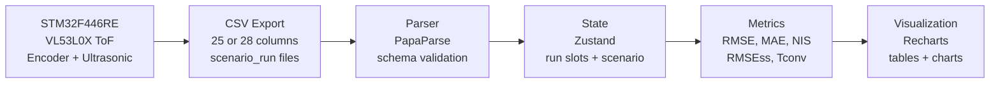

# Edge AI Kalman Dashboard

졸업논문 **「Edge AI 기반 적응형 칼만 필터의 임베디드 실시간 적용 연구」** 결과를 웹에서 검토할 수 있도록 재구성한 **Next.js 기반 연구 데이터 대시보드**입니다.

이 프로젝트는 새 실험 결과를 생성하는 모델이 아니라, STM32F446RE에서 수집한 실험 CSV와 논문 확정값을 한곳에 모아 **CSV 파싱, 지표 계산, 상태 관리, 시각화, 포트폴리오 설명**까지 연결한 산출물입니다.

## Portfolio Positioning

이 웹 페이지가 보여줘야 하는 핵심 역량은 다음 세 가지입니다.

| 역량 | 웹에서 드러나는 방식 |
|---|---|
| Embedded AI 이해 | STM32F446RE, VL53L0X ToF, HC-SR04, encoder, TinyML INT8 추론 조건을 명확히 설명 |
| Data pipeline 구현 | CSV export → PapaParse validation → Zustand run slots → metric engine → Recharts dashboard 흐름 |
| 연구 결과 해석 | Raw ToF, Fixed KF, CM-AKF, TinyML-AKF 비교를 논문 지표와 같은 기준으로 표시 |

포트폴리오 문장으로는 **"MCU 실험 데이터를 TypeScript 기반 분석 파이프라인으로 재구성한 Edge AI 연구 대시보드"**라고 소개하면 가장 깔끔합니다.

## Quick Start

```bash
npm install
npm run dev
```

브라우저에서 `http://localhost:3000` 접속 후 `분석하기` 페이지에서 시나리오를 선택하면 내장 CSV를 로드해 바로 확인할 수 있습니다.

```bash
npm run verify
```

`verify`는 `npm run typecheck`와 `npm run build`를 순서대로 실행합니다.

## Research Anchors

| 연구 질문 | 대시보드에서 보여줄 포인트 |
|---|---|
| RQ1. TinyML 추론이 200 Hz 제어 루프 안에서 가능한가? | E4 기반 평균 추론 시간 35.32 us, 500 us 예산 대비 14.2배 여유, overrun 0건 |
| RQ2. CM-AKF와 TinyML-AKF는 복합 노이즈에서 어떤 차이를 보이는가? | E2/E3/E5 시나리오별 RMSE, MAE, NIS, RMSEss, Tconv 비교 |
| RQ3. 다변량 feature가 R 추정 거동에 기여하는가? | E3 차단 해제 후 TinyML R 회복 60 ms, CM-AKF 160 ms, 약 2.7배 빠른 회복 |

수치의 1차 기준은 논문 본문과 [lib/paper-results.ts](/Users/imdayeong/Desktop/졸업논문/edge-ai-kalman-dashboard/lib/paper-results.ts)입니다. README, UI, 에이전트 지침이 서로 충돌하면 논문 및 `paper-results.ts`를 우선합니다.

## Architecture



## Key Results

| 지표 | 값 | 포트폴리오에서의 의미 |
|---|---:|---|
| E3 RMSE 개선 | 70.1% | ToF 차단 구간에서 CM-AKF가 Raw 대비 오차를 크게 줄인 사례 |
| TinyML 평균 추론 시간 | 35.32 us | 200 Hz 루프 내 Edge AI 추론 가능성 입증 |
| TinyML 추론 마진 | 14.2x | 500 us 목표 예산 대비 여유 |
| E3 R 회복 속도 | 2.7x | TinyML-AKF가 CM-AKF보다 빠르게 R 추정값을 정상 영역으로 회복 |
| E4 TinyML 추론 횟수 | 242,992 | 30분 × 3 run 장기 안정성 검증 규모 |
| E4 overrun | 0건 | 실시간 루프 시간 제약 위반 없음 |

## Main Routes

| Route | 역할 | 현재 상태 |
|---|---|---|
| `/upload` | 분석하기. 시나리오 선택, 내장 CSV 로드, 직접 CSV 업로드, 인라인 대시보드 | 핵심 진입점 |
| `/results` | RQ1~RQ3 결과 요약, 논문 표 기반 종합 비교 | 포트폴리오 설명용 |
| `/method` | 지표 정의, 논문 기준, 코드 매핑 | 검증 근거 |
| `/dashboard` | 시나리오별 view 렌더링 | 분석 화면 보조 |
| `/ablation` | 6-feature vs 3-feature TinyML ablation | 연구 결과 보조 |
| `/realtime` | 실시간성 설명 | `/results` 또는 보조 화면으로 활용 |

포트폴리오 사용자는 `/upload`, `/results`, `/method`만 따라가도 전체 흐름을 이해할 수 있어야 합니다.

## CSV Schema

최종 실험 CSV는 25컬럼 또는 28컬럼입니다. 28컬럼은 TinyML 결과 3개가 추가된 형식입니다.

### 25-column Base Schema

```text
seq, timestamp_ms, tof_distance_mm, tof_signal_rate, tof_range_status,
us_distance_mm, encoder_distance_mm, encoder_speed_mms, sensor_disagree,
tof_meas_rate, gt_distance_mm, scenario_id,
fixed_estimate_mm, fixed_residual, fixed_residual_var, fixed_residual_mean,
fixed_kalman_gain, fixed_innovation_cov,
cm_estimate_mm, cm_residual, cm_residual_var, cm_residual_mean,
cm_kalman_gain, cm_innovation_cov, cm_R
```

### TinyML Extension

```text
tinyml_estimate_mm, tinyml_R, tinyml_infer_us
```

`lib/e1-csv-parser.ts`는 25/28컬럼을 자동 감지합니다. TinyML 컬럼 3개가 모두 있을 때만 TinyML 라인과 메트릭을 활성화합니다.

## Metrics

| Metric | 구현 위치 | 기준 |
|---|---|---|
| RMSE | [lib/metrics.ts](/Users/imdayeong/Desktop/졸업논문/edge-ai-kalman-dashboard/lib/metrics.ts) | `sqrt(mean((estimate - gt)^2))` |
| MAE | [lib/metrics.ts](/Users/imdayeong/Desktop/졸업논문/edge-ai-kalman-dashboard/lib/metrics.ts) | `mean(abs(estimate - gt))` |
| NIS pass rate | [lib/metrics.ts](/Users/imdayeong/Desktop/졸업논문/edge-ai-kalman-dashboard/lib/metrics.ts) | chi-square df=1, 95% interval `[0.00098, 5.024]` |
| RMSEss | [lib/metrics.ts](/Users/imdayeong/Desktop/졸업논문/edge-ai-kalman-dashboard/lib/metrics.ts) | 후반 50 frame steady-state RMSE |
| Tconv | [lib/metrics.ts](/Users/imdayeong/Desktop/졸업논문/edge-ai-kalman-dashboard/lib/metrics.ts) | 50 frame sliding RMSE가 `1.1 × RMSEss` 이하가 되는 최초 시각 |
| Ablation MAE_R/MAPE_R | [app/ablation/page.tsx](/Users/imdayeong/Desktop/졸업논문/edge-ai-kalman-dashboard/app/ablation/page.tsx) | TinyML R 추정값과 CM pseudo-label 비교 |

TinyML-AKF에는 `innovation_cov` 컬럼이 없으므로 NIS는 계산하지 않고 `-`로 표시합니다.

## Data Assets

| 위치 | 내용 |
|---|---|
| `public/data/E1_run01.csv` ~ `E1_run05.csv` | E1 baseline 5 run |
| `public/data/E2_white_*`, `E2_black_*`, `E2_acryl_*` | E2 표면별 실험 CSV |
| `public/data/E3_run01.csv` ~ `E3_run05.csv` | E3 ToF 차단 실험 |
| `public/data/E4_run01.csv` ~ `E4_run03.csv` | E4 정적 장기 안정성 CSV |
| `public/data/E5_run01.csv` ~ `E5_run05.csv` | E5 미지 표면 일반화 |
| `public/data/ablation_holdout_results.csv` | 표 5-3 hold-out ablation |
| `docs/*.docx` | 논문 최종본 참조 문서 |

## Project Structure

```text
app/
  upload/page.tsx       # 분석하기, CSV 로드, 직접 업로드
  results/page.tsx      # RQ별 연구 결과 요약
  method/page.tsx       # 지표 정의와 코드 매핑
  dashboard/page.tsx    # 시나리오별 view 렌더링
  ablation/page.tsx     # TinyML feature ablation

components/
  views/                # E0~E5 시나리오 view
  e1/                   # run selector, algorithm toggle, charts
  ui/                   # 공통 panel, metric card, table

lib/
  e1-csv-parser.ts      # 25/28컬럼 CSV parser
  e1-metrics.ts         # run별 metric aggregation
  e1-store.ts           # Zustand scenario/run state
  metrics.ts            # 논문 지표 순수 함수
  paper-results.ts      # 논문 확정값 단일 진실 소스
```

## Demo Flow

1. `/upload`에서 `E3 - ToF 차단 구간` 선택
2. 내장 CSV 로드 후 Raw, Fixed, CM-AKF, TinyML-AKF 위치 추정 시계열 확인
3. `R` 회복 시계열에서 CM-AKF와 TinyML-AKF의 회복 속도 차이 확인
4. `/results`에서 RQ1~RQ3 요약 확인
5. `/method`에서 RMSE, NIS, RMSEss, Tconv 정의와 코드 위치 확인

이 흐름은 면접이나 발표에서 “논문을 웹 포트폴리오로 옮길 때 무엇을 직접 구현했는가”를 설명하기 좋습니다.

## Technical Decisions

| 결정 | 선택 | 이유 |
|---|---|---|
| Framework | Next.js 15 App Router | 정적 배포와 React 기반 분석 화면 구성에 적합 |
| Parser | PapaParse | header 기반 CSV 처리와 브라우저 파싱 안정성 |
| State | Zustand | scenario/run slot 상태를 작은 코드로 관리 |
| Chart | Recharts | React 컴포넌트로 시계열, 막대, 게이지를 빠르게 구성 |
| Data source | `public/data` 정적 CSV | 연구 데이터가 고정되어 서버 없이 재현 가능 |
| Database | 미도입 | Supabase 이력 저장은 선택 기능. 현재는 포트폴리오 재현성을 우선 |

## Agent Files

이 저장소에는 두 종류의 에이전트 지침이 있습니다.

| 위치 | 용도 |
|---|---|
| `.claude/agents/*.md` | Claude 계열 에이전트용 Markdown 지침 |
| `.codex/agents/*.toml` | Codex 계열 에이전트용 TOML 지침 |

두 세트 모두 같은 프로젝트 원칙을 공유합니다.

- 논문 본문과 `lib/paper-results.ts`를 수치 기준으로 삼기
- 25/28컬럼 최종 CSV 스키마 유지
- 새 연구 결과나 성능 예측을 만들지 않기
- 포트폴리오 관점에서 분석 흐름을 선명하게 만들기

## Roadmap

| 단계 | 상태 | 다음 액션 |
|---|---|---|
| Core data pipeline | Done | parser/metrics regression 확인 유지 |
| E0~E5 scenario dashboard | Done | UX 흐름 단순화와 모바일 QA |
| Results/method 설명 페이지 | Done | 포트폴리오 문장 다듬기 |
| Deployment | Planned | Vercel 배포 후 README URL 갱신 |
| Presentation assets | Planned | 대표 스크린샷, 60초 demo flow 정리 |
| Optional storage | Deferred | Supabase 업로드 이력 저장은 필요 시 별도 구현 |

## Limitations

- 이 대시보드는 논문 결과를 재현·시각화하는 도구이며, 새 조건의 성능을 예측하지 않습니다.
- E0~E5 외 실험 조건은 검증된 결과처럼 표현하지 않습니다.
- TinyML NIS는 `innovation_cov`가 없어 계산하지 않습니다.
- Supabase 저장, WebSocket/SSE 실시간 스트리밍, 사용자 계정 기능은 현재 범위가 아닙니다.
- 논문 본문, `paper-results.ts`, README가 충돌하면 논문 본문과 `paper-results.ts`가 우선입니다.
