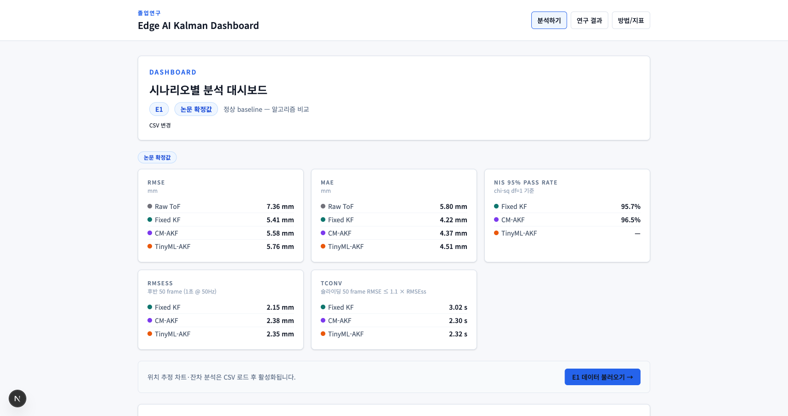
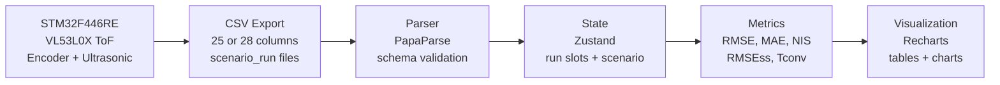
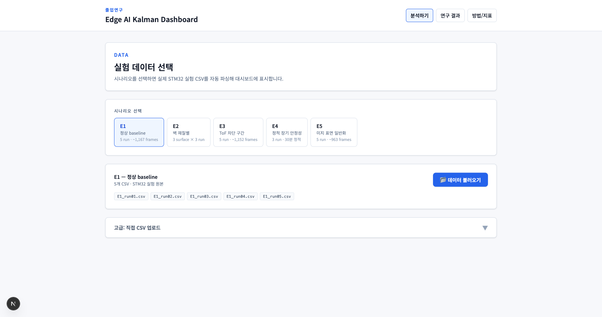
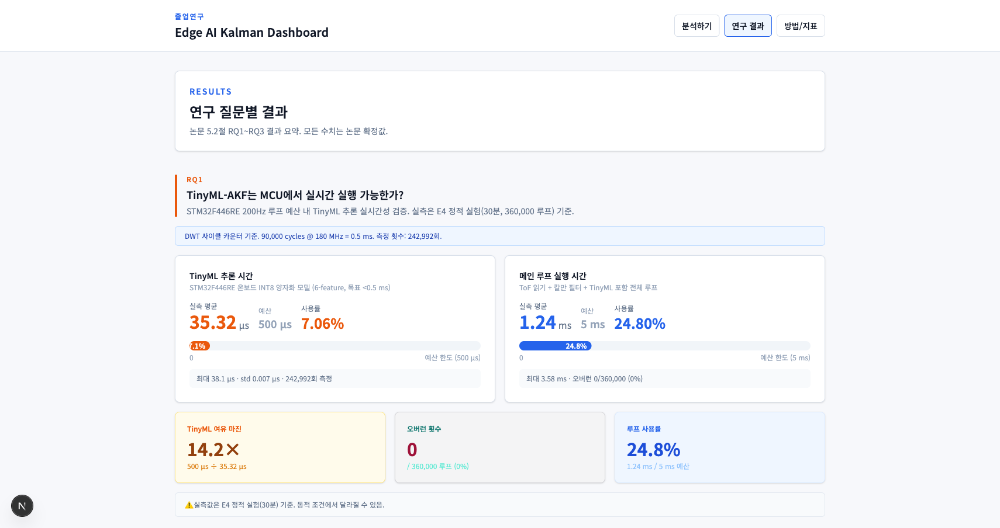
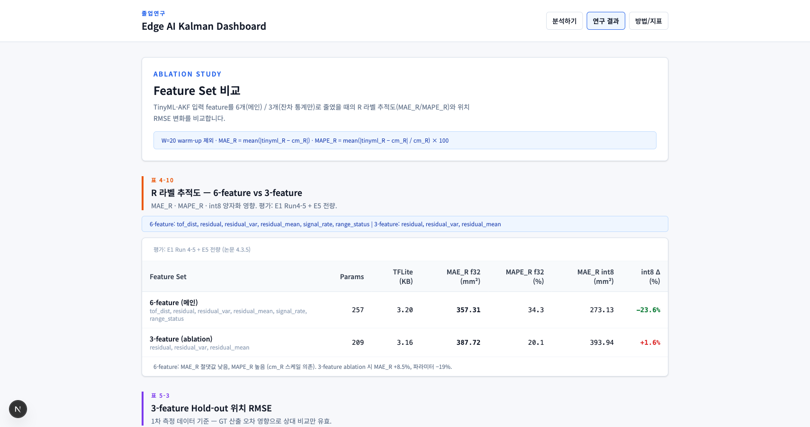
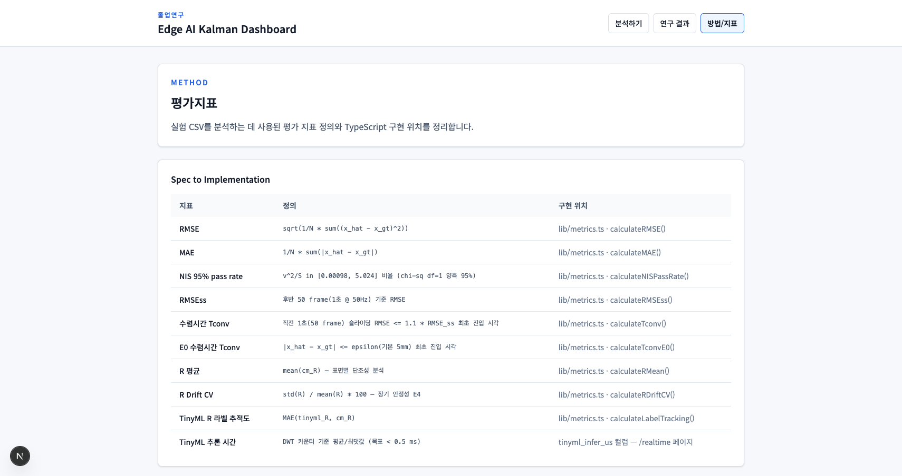

# Edge AI Kalman Dashboard

**Live**: https://edge-ai-kalman-dashboard.vercel.app



STM32F446RE에서 수집한 적응형 칼만 필터 실험 데이터를 웹에서 검증할 수 있도록 재구성한 **Next.js 기반 연구 데이터 대시보드**입니다.

졸업논문 「Edge AI 기반 적응형 칼만 필터의 임베디드 실시간 적용 연구」의 실험 CSV를 입력으로 받아, 스키마 검증 → 지표 계산 → 시각화까지의 파이프라인을 구현했습니다. 새로운 성능을 예측하는 도구가 아니라, 이미 확정된 실험 결과를 재현 가능한 형태로 검증하는 도구입니다.

## Quick Start

```bash
npm install
npm run dev
```

`http://localhost:3000` 접속 후 `Analyze` 페이지에서 시나리오를 선택하면 내장 CSV를 로드해 바로 확인할 수 있습니다.

## Testing

```bash
npm test          # 단위 테스트 실행 (N 케이스)
npm run test:watch
npm run verify    # typecheck → test → build
```

`verify`는 세 단계를 순차 실행하며, 하나라도 실패하면 중단됩니다.

| 대상 | 파일 | 케이스 |
|---|---|---:|
| 지표 계산 순수 함수 | [lib/metrics.test.ts](./lib/metrics.test.ts) | 12 |
| CSV 파서 스키마 검증 | [lib/csv-parser.test.ts](./lib/csv-parser.test.ts) | 6 |
| E3 차단 탐지 로직 | [lib/e3-blocking.test.ts](./lib/e3-blocking.test.ts) | N |
| **합계** | | **N** |

지표 함수는 외부 상태에 의존하지 않는 순수 함수로 분리해 두었기 때문에, 논문 정의와 구현이 일치하는지 단위 테스트로 직접 검증할 수 있습니다.

## Research Questions

| 연구 질문 | 대시보드에서 확인 가능한 근거 |
|---|---|
| RQ1. TinyML 추론이 200 Hz 제어 루프 안에서 가능한가? | E4 기준 평균 추론 시간 35.32 us (TinyML 목표 예산 500 us의 7.1%), overrun 0건 |
| RQ2. CM-AKF와 TinyML-AKF는 복합 노이즈에서 어떤 차이를 보이는가? | E2/E3/E5 시나리오별 RMSE, MAE, NIS 비교, E3 차단 해제 후 R 회복 60 ms 대 160 ms |
| RQ3. 잔차 통계 외 feature가 R 추정에 기여하는가? | E3에서 signal rate가 차단 진입보다 4 frame 먼저 변화, E2 표면별 signal rate 분포 |

수치의 1차 기준은 논문 본문과 [lib/paper-results.ts](./lib/paper-results.ts)입니다. UI 표시와 논문 값이 충돌하면 논문과 `paper-results.ts`를 우선합니다.

## Architecture


```mermaid
graph LR
  A["STM32F446RE<br/>VL53L0X ToF<br/>Encoder + Ultrasonic"]
  B["CSV Export<br/>25 or 28 columns<br/>scenario_run files"]
  C["Parser<br/>PapaParse<br/>schema validation"]
  D["State<br/>Zustand<br/>run slots + scenario"]
  E["Metrics<br/>RMSE, MAE, NIS<br/>RMSEss, Tconv"]
  F["Visualization<br/>Recharts<br/>tables + charts"]

  A --> B
  B --> C
  C --> D
  D --> E
  E --> F
```

## Key Results

| 지표 | 값 | 설명 |
|---|---:|---|
| E3 RMSE 개선 | 70.1% | ToF 차단 구간에서 CM-AKF가 Raw 대비 줄인 오차 |
| TinyML 평균 추론 시간 | 35.32 us | 200 Hz 루프 내 추론 완료 |
| TinyML 추론 마진 | 14.2x | 500 us 목표 예산 대비 여유 |
| E3 R 회복 속도 | 2.7x | TinyML-AKF가 CM-AKF 대비 빠르게 R 추정값 회복 |
| E4 TinyML 추론 횟수 | 242,992 | 30분 × 3 run 장기 안정성 검증 규모 |
| E4 overrun | 0건 | 실시간 루프 시간 제약 위반 없음 |

## Troubleshooting

구현 과정에서 해결한 문제 3건입니다.

### 1. Ground Truth 컬럼이 전부 0으로 기록됨

E1 1차 측정 CSV의 `gt_distance_mm`이 230~236행 전체에서 0.0으로 기록되어 있어, 오차 기반 지표(RMSE, MAE)를 계산할 수 없었습니다.

논문 4.1.2절은 ToF 측정의 시작·종료 시점을 거리 anchor로 두고, 엔코더를 두 anchor 사이의 진행 비율을 분배하는 보간 변수로만 사용해 GT를 산정합니다.

```
GT(k) = ToF_start − (enc(k) / enc_last) · (ToF_start − ToF_end)
```

엔코더 누적값을 절대 거리 기준으로 쓰지 않는 이유는 수동 굴림 환경의 바퀴 슬립입니다. 전체 run에서 엔코더 누적 이동량은 ToF 양 끝점 기준 실제 이동 거리의 75~94% 수준에 그쳤고, 이를 절대 GT로 사용하면 위치 추정 RMSE가 슬립량만큼 과대평가됩니다.

정지 구간(전체의 32~40%)의 포함 여부는 지표에 영향을 주므로 `TrimControl`로 제외 범위를 조정할 수 있게 했습니다. 상세 정의는 [docs/paper-summary.md](./docs/paper-summary.md)를 참고하세요.

### 2. 실험 진행 중 CSV 스키마가 18 → 25/28컬럼으로 변경

초기 파서는 18컬럼 고정 스키마를 가정하고 있었으나, 최종 실험에서 알고리즘별 잔차·이노베이션 공분산 컬럼이 추가되어 25컬럼(Fixed KF + CM-AKF)과 28컬럼(TinyML 3컬럼 추가)의 두 형식이 공존하게 되었습니다.

컬럼 존재 여부로 스키마를 자동 감지하는 방식으로 전환했습니다. TinyML 컬럼 3개가 모두 있을 때만 `hasTinyML` 플래그를 세우고, 해당 라인과 지표를 활성화합니다. 부분적으로만 존재하는 경우는 불완전 데이터로 간주해 활성화하지 않습니다.

### 3. 검증 코드가 실행 경로에 없어 오류가 누락됨

지표·파서 검증 코드를 `lib/*.examples.ts`에 `node:assert` 기반으로 작성해 두었으나, 이를 호출하는 진입점이 없어 실제로는 한 번도 실행되지 않았습니다. `verify` 스크립트가 `typecheck`와 `build`만 수행했기 때문에, 문자열 리터럴로 작성된 테스트 데이터의 오류는 타입 검사에서도 걸러지지 않았습니다.

Vitest를 도입해 정식 단위 테스트로 전환하는 과정에서, CSV 테스트 데이터의 필수 컬럼(`tof_distance_mm`)이 빈 값으로 들어가 파서가 예외를 던지는 문제를 발견했습니다. `verify`에 `test` 단계를 추가해 검증이 누락될 수 없는 구조로 변경했습니다.

## CSV Schema

최종 실험 CSV는 25컬럼 또는 28컬럼입니다. 28컬럼은 TinyML 결과 3개가 추가된 형식입니다.

### 25-column Base Schema

```text
seq, timestamp_ms, tof_distance_mm, tof_signal_rate, tof_range_status,
us_distance_mm, encoder_distance_mm, encoder_speed_mms, sensor_disagree,
tof_meas_rate, gt_distance_mm, scenario_id,
fixed_estimate_mm, fixed_residual, fixed_residual_var, fixed_residual_mean,
fixed_kalman_gain, fixed_innovation_cov,
cm_estimate_mm, cm_residual, cm_residual_var, cm_residual_mean,
cm_kalman_gain, cm_innovation_cov, cm_R
```

### TinyML Extension

```text
tinyml_estimate_mm, tinyml_R, tinyml_infer_us
```

nullable 컬럼(`tof_signal_rate`, `tof_range_status`, `us_distance_mm`, `sensor_disagree`, `tof_meas_rate`, `*_residual_var`, `*_residual_mean`)은 빈 값을 `null`로 파싱하고, 그 외 필수 컬럼이 비어 있으면 예외를 던집니다.

## Metrics

| Metric | 구현 위치 | 정의 |
|---|---|---|
| RMSE | [lib/metrics.ts](./lib/metrics.ts) | `sqrt(mean((estimate - gt)^2))` |
| MAE | [lib/metrics.ts](./lib/metrics.ts) | `mean(abs(estimate - gt))` |
| NIS pass rate | [lib/metrics.ts](./lib/metrics.ts) | chi-square df=1, 95% interval `[0.00098, 5.024]` |
| RMSEss | [lib/metrics.ts](./lib/metrics.ts) | 후반 50 frame steady-state RMSE |
| Tconv | [lib/metrics.ts](./lib/metrics.ts) | 50 frame sliding RMSE가 `1.1 × RMSEss` 이하가 되는 최초 시각 |
| MAE_R / MAPE_R | [app/ablation/page.tsx](./app/ablation/page.tsx) | TinyML R 추정값과 CM pseudo-label 비교 |

TinyML-AKF에는 `innovation_cov` 컬럼이 없어 NIS를 계산할 수 없으므로 `—`로 표시합니다. 계산 불가와 값이 0인 경우를 구분하기 위한 처리입니다.

## Main Routes

| Route | 역할 |
|---|---|
| `/upload` | 시나리오 선택, 내장 CSV 로드, 직접 CSV 업로드, 인라인 대시보드 |
| `/results` | RQ1~RQ3 결과 요약, 논문 표 기반 종합 비교, 실시간 성능 게이지 |
| `/method` | 지표 정의, 필터 파라미터, 코드 매핑 |
| `/dashboard` | 시나리오별 view 렌더링 |
| `/ablation` | 6-feature vs 3-feature TinyML ablation |

<details>
<summary>화면 미리보기 (업로드 / 결과 / Ablation / 방법론)</summary>









</details>

## Demo Flow

1. `/upload`에서 `E3 - ToF 차단 구간` 선택
2. 내장 CSV 로드 후 Raw, Fixed, CM-AKF, TinyML-AKF 위치 추정 시계열 확인
3. `R` 회복 시계열에서 CM-AKF와 TinyML-AKF의 회복 속도 차이 확인
4. `/results`에서 RQ1~RQ3 요약 확인
5. `/method`에서 RMSE, NIS, RMSEss, Tconv 정의와 코드 위치 확인

## Technical Decisions

| 결정 | 선택 | 이유 |
|---|---|---|
| Framework | Next.js 15 App Router | 정적 배포와 React 기반 분석 화면 구성에 적합 |
| Parser | PapaParse | header 기반 CSV 처리와 브라우저 파싱 안정성 |
| State | Zustand | scenario/run slot 상태를 작은 코드로 관리 |
| Chart | Recharts | React 컴포넌트로 시계열, 막대, 게이지 구성 |
| Data source | `public/data` 정적 CSV | 실험 데이터가 고정되어 서버 없이 재현 가능 |
| Test | Vitest | Next.js 15 + TypeScript 환경에서 별도 설정 없이 동작 |
| Deploy | Vercel | `main` 푸시 시 자동 배포, 정적 산출물 호스팅 |

### 서버·영속 계층을 두지 않은 이유

입력 데이터가 논문 확정본 26종으로 고정되어 있고, 이후 변경되지 않습니다. RDB를 도입하면 스키마 마이그레이션이라는 변경 대상이 새로 생기고, 클론 후 `npm run dev` 한 번으로 논문 수치를 재현한다는 목표가 깨집니다. 데이터를 정적 자산으로 두고 파싱·지표 계산을 클라이언트에서 수행하는 구성을 선택했습니다.

데이터가 축적되는 요구(다회 실험 이력 비교, 여러 사용자의 CSV 보관)가 생기는 시점에 `/upload`의 파싱 경로를 서버로 옮기고 그 뒤에 영속 계층을 붙이는 것이 다음 단계입니다.

## Data Assets

| 위치 | 내용 |
|---|---|
| `public/data/E1_run01.csv` ~ `E1_run05.csv` | E1 baseline 5 run |
| `public/data/E2_white_*`, `E2_black_*`, `E2_acryl_*` | E2 표면별 실험 CSV |
| `public/data/E3_run01.csv` ~ `E3_run05.csv` | E3 ToF 차단 실험 |
| `public/data/E4_run01.csv` ~ `E4_run03.csv` | E4 정적 장기 안정성 (파일당 약 14 MB) |
| `public/data/E5_run01.csv` ~ `E5_run05.csv` | E5 미지 표면 일반화 |
| `public/data/ablation_holdout_results.csv` | hold-out ablation 결과 |
| [docs/paper-summary.md](./docs/paper-summary.md) | 논문 요약 및 실험 조건 |

E4는 30분 × 3 run 정적 측정으로 파일당 약 14 MB이며, 브라우저에서 파싱하면 초기 로딩이 다른 시나리오 대비 수백 배로 늘어납니다. E4는 장기 안정성 확인용이라 시계열 탐색이 필요하지 않으므로, 대시보드 로드 대상에서 제외하고 논문 확정 수치(`paper-results.ts`)를 표시합니다. 원본 CSV는 검증 목적으로 저장소에 유지합니다.

## Project Structure

```text
app/
  upload/page.tsx       # 시나리오 선택, CSV 로드, 직접 업로드
  results/page.tsx      # RQ별 결과 요약
  method/page.tsx       # 지표 정의와 코드 매핑
  dashboard/page.tsx    # 시나리오별 view 렌더링
  ablation/page.tsx     # TinyML feature ablation

components/
  views/                # E0~E5 시나리오 view
  e1/                   # run selector, algorithm toggle, charts
  ui/                   # 공통 panel, metric card, table

lib/
  e1-csv-parser.ts      # 25/28컬럼 CSV parser
  e1-metrics.ts         # run별 metric aggregation, GT 복원
  e1-store.ts           # Zustand scenario/run state
  metrics.ts            # 논문 지표 순수 함수
  metrics.test.ts       # 지표 함수 단위 테스트
  csv-parser.test.ts    # 파서 스키마 검증 테스트
  e3-blocking.test.ts   # E3 차단 탐지 로직 테스트
  paper-results.ts      # 논문 확정값 단일 진실 소스
```

## Roadmap

진행 이력은 [ROADMAP.md](./ROADMAP.md)를 참고하세요.

| 단계 | 상태 |
|---|---|
| Core data pipeline | Done |
| E0~E5 scenario dashboard | Done |
| Results / method 설명 페이지 | Done |
| 단위 테스트 및 검증 파이프라인 | Done |
| Vercel 배포 | Done |

## Limitations

- 이 저장소는 프론트엔드·데이터 시각화 범위의 프로젝트입니다. 서버 API와 영속 계층은 위 근거에 따라 의도적으로 두지 않았습니다.
- 논문 실험 결과를 재현·검증하는 도구이며, 새로운 조건의 성능을 예측하지 않습니다.
- E0~E5 외 실험 조건은 검증된 결과처럼 표현하지 않습니다.
- TinyML NIS는 `innovation_cov` 컬럼이 없어 계산하지 않습니다.
- GT 복원은 정지 구간이 존재하는 데이터에서만 유효합니다.
- E4는 파일 크기 때문에 브라우저 파싱 대상에서 제외되어 있으며, 논문 확정 수치로만 표시됩니다.
- 사용자 계정, 실시간 스트리밍(WebSocket/SSE)은 범위에 포함되지 않습니다.
- 논문 본문, `paper-results.ts`, README가 충돌하면 앞의 두 항목이 우선합니다.